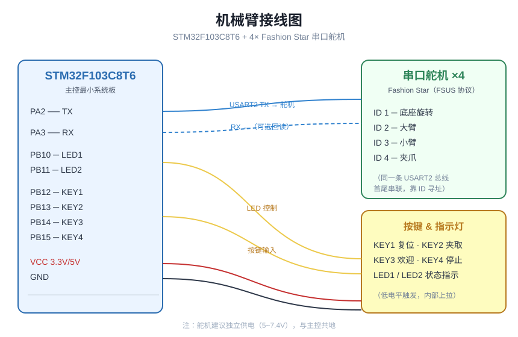
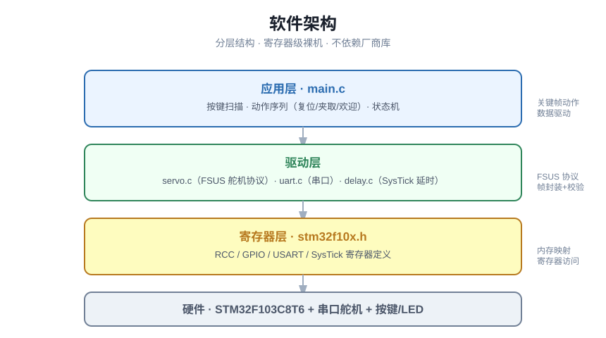
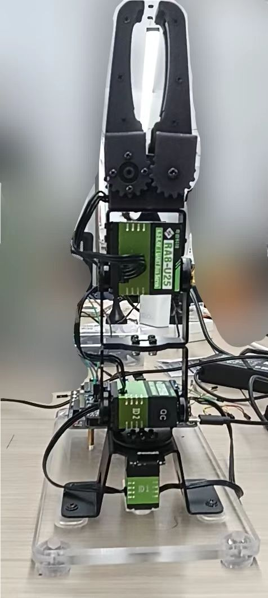

<div align="center">

# 🦾 四自由度机械臂控制系统

[]()
[]()
[](LICENSE)
[]()
[]()

基于 **STM32F103C8T6** 与 **4 个串口总线舵机**的四自由度机械臂控制系统。<br/>
全部代码**寄存器级裸机实现**，不依赖任何厂商库（STM32 标准库 / HAL）。

</div>

---

## ✨ 功能特性

- 🤖 **四自由度控制**：底座旋转、大臂、小臂、夹爪，4 个 Fashion Star 串口舵机独立寻址
- 📡 **FSUS 串口舵机协议**：从零实现帧封装、校验和计算、角度/周期/功率控制
- 🎬 **三套动作序列**：复位（收纳）、夹取（搬运）、欢迎（挥手），按键一键触发
- ⏱️ **精确延时**：基于 SysTick 实现微秒/毫秒级延时
- 🔘 **按键 + LED**：软件消抖，4 键控制 + 2 路 LED 状态指示

## 🧰 硬件清单

| 器件 | 型号 / 规格 | 数量 |
|------|------------|------|
| 主控 | STM32F103C8T6 最小系统板 | 1 |
| 舵机 | Fashion Star 串口舵机（FSUS 协议） | 4 |
| 按键 | 轻触按键 | 4 |
| LED | 发光二极管 + 限流电阻 | 2 |
| 电源 | 5V / 7.4V（舵机建议独立供电） | 1 |

## 🔌 接线图



## 🏗️ 软件架构



## 🎬 实物演示

### 实物图



### 演示视频

- 视频1：[`docs/demo-1.mp4`](docs/demo-1.mp4)
- 视频2：[`docs/demo-2.mp4`](docs/demo-2.mp4)

> GitHub 不支持直接在 README 嵌入播放视频，点击上方链接可在线观看或下载。

## 📦 目录结构

```
robotic-arm/
├── Inc/
│   ├── stm32f10x.h         # 寄存器级外设定义
│   ├── delay.h             # SysTick 延时
│   ├── uart.h              # 串口驱动
│   ├── servo.h             # FSUS 舵机协议
│   └── system_stm32f10x.h
├── Src/
│   ├── main.c              # 主程序 + 动作序列 + 按键扫描
│   ├── delay.c
│   ├── uart.c
│   ├── servo.c
│   └── system_stm32f10x.c
├── docs/
│   ├── wiring.svg          # 接线图
│   ├── architecture.svg    # 软件架构图
│   ├── demo.jpg            # 机械臂全景
│   ├── demo-1.mp4          # 演示视频1
│   └── demo-2.mp4          # 演示视频2
├── startup_stm32f10x_md.s  # 启动文件
└── README.md
```

## 🚀 编译与烧录（Keil MDK）

1. 新建 Keil uVision5 工程，器件选择 **STM32F103C8**
2. 加入 `startup_stm32f10x_md.s` 与 `Src/` 下所有 `.c`
3. `Inc/` 加入 Include Paths，勾选 `Use MicroLIB`
4. 编译生成 `.hex`，用 ST-Link / 串口烧录

## 🧭 二次开发

- 动作序列定义在 `main.c` 的 `motion_*[]` 数组中，采用**关键帧**方式，添加新动作只需新增一个数组
- 舵机角度、周期、功率在 `servo_set_angle()` 中控制，支持 -180°~180°
- 串口波特率、引脚定义集中在 `uart.h` / `main.c` 顶部

## 📝 更新日志

- **2026-08-16**：改用内部 HSI 时钟（64MHz，不依赖外部晶振）；修复 delay_us 24 位计数器溢出
- **2026-08-16**：舵机闭环到位检测 + 停止键可随时急停
- **2026-08-14**：添加实物演示图与演示视频
- **2026-08-14**：美化 README（徽章、接线图、架构图、MIT 许可证）
- **2026-08-14**：初版发布

## 📄 License

[MIT](LICENSE) © hug-creator